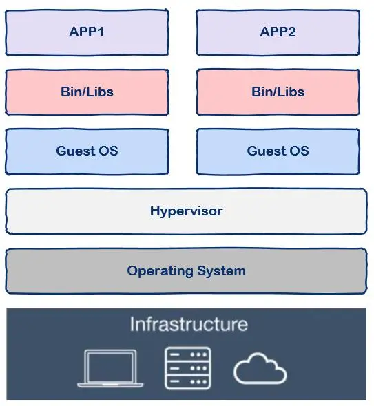

# Docker 技术分享
> build once, run everywhere

## 大纲
* 容器技术
    + 容器技术的起源
    + 什么是容器
    + 容器技术 VS 虚拟机
* Docker
    + 什么是Docker
    + Docker的架构(略)
    + Docker基本概念
    + Docker的好处
* Docker 实操(Demo)
    + 场景一: XXXX(面向前端工程师的场景)
    + 场景二: XXXX(面向后端工程师的场景)
    + 场景三: XXXX(面向算法工程师的场景)
* 预告: kubernetes 技术分享
    + 什么是kubernetes
    + kubernetes的基本概念
    + kubernetes的实操

## 容器技术

### 容器技术的起源
假设你们公司正在秘密研发下一个“今日头条”APP，我们姑且称为明日头条，程序员自己从头到尾搭建了一套环境开始写代码，写完代码后程序员要把代码交给测试同学测试，这时测试同学开始从头到尾搭建这套环境，测试过程中出现问题程序员也不用担心，大可以一脸无辜的撒娇，“明明在人家的环境上可以运行的”。

测试同学测完后终于可以上线了，这时运维同学又要重新从头到尾搭建这套环境，费了九牛二虎之力搭建好环境开始上线，糟糕，上线系统就崩溃了，这时心理素质好的程序员又可以施展演技了，“明明在人家的环境上可以运行的”。

从整个过程可以看到，不但我们重复搭建了三套环境还要迫使程序员转行演员浪费表演才华，典型的浪费时间和效率，聪明的程序员是永远不会满足现状的，因此又到了程序员改变世界的时候了，容器技术应运而生。

有的同学可能会说：“等等，先别改变世界，我们有虚拟机啊，VMware好用的飞起，先搭好一套虚拟机环境然后给测试和运维clone出来不就可以了吗?”

在没有容器技术之前，这确实是一个好办法，只不过这个办法还没有那么好。

先科普一下，现在云计算其底层的基石就是虚拟机技术，云计算厂商买回来一堆硬件搭建好数据中心后使用虚拟机技术就可以将硬件资源进行切分了，比如可以切分出100台虚拟机，这样就可以卖给很多用户了。

你可能会想这个办法为什么不好呢?

### 什么是容器
容器一词的英文是container，其实container还有集装箱的意思，集装箱绝对是商业史上了不起的一项发明，大大降低了海洋贸易运输成本。让我们来看看集装箱的好处：

* 集装箱之间相互隔离
* 长期反复使用
* 快速装载和卸载
* 规格标准，在港口和船上都可以摆放

回到软件中的容器，其实容器和集装箱在概念上是很相似的。

现代软件开发的一大目的就是隔离，应用程序在运行时相互独立互不干扰，这种隔离实现起来是很不容易的，其中一种解决方案就是上面提到的虚拟机技术，通过将应用程序部署在不同的虚拟机中从而实现隔离。

但是虚拟机技术有上述提到的各种缺点，那么容器技术又怎么样呢?

与虚拟机通过操作系统实现隔离不同，容器技术只隔离应用程序的运行时环境但容器之间可以共享同一个操作系统，这里的运行时环境指的是程序运行依赖的各种库以及配置。

### 容器技术 VS 虚拟机
我们知道和一个单纯的应用程序相比，操作系统是一个很重而且很笨的程序，简称笨重，有多笨重呢?

我们知道操作系统运行起来是需要占用很多资源的，大家对此肯定深有体会，刚装好的系统还什么都没有部署，单纯的操作系统其磁盘占用至少几十G起步，内存要几个G起步。

假设我有一台机器，16G内存，需要部署三个应用，那么使用虚拟机技术可以这样划分：

从图中我们可以看到容器更加的轻量级且占用的资源更少，与操作系统动辄几G的内存占用相比，容器技术只需数M空间，因此我们可以在同样规格的硬件上大量部署容器，这是虚拟机所不能比拟的，而且不同于操作系统数分钟的启动时间容器几乎瞬时启动，容器技术为打包服务栈提供了一种更加高效的方式，So cool。

那么我们该怎么使用容器呢?这就要讲到docker了。

注意，容器是一种通用技术，docker只是其中的一种实现。

### 什么是docker

docker是一个用Go语言实现的开源项目，可以让我们方便的创建和使用容器，docker将程序以及程序所有的依赖都打包到docker container，这样你的程序可以在任何环境都会有一致的表现，这里程序运行的依赖也就是容器就好比集装箱，容器所处的操作系统环境就好比货船或港口，程序的表现只和集装箱有关系(容器)，和集装箱放在哪个货船或者哪个港口(操作系统)没有关系。

因此我们可以看到docker可以屏蔽环境差异，也就是说，只要你的程序打包到了docker中，那么无论运行在什么环境下程序的行为都是一致的，程序员再也无法施展表演才华了，不会再有“在我的环境上可以运行”，真正实现“build once, run everywhere”。

此外docker的另一个好处就是快速部署，这是当前互联网公司最常见的一个应用场景，一个原因在于容器启动速度非常快，另一个原因在于只要确保一个容器中的程序正确运行，那么你就能确信无论在生产环境部署多少都能正确运行。

### Docker基本概念

docker中有这样几个概念：

* dockerfile
* image
* container

实际上你可以简单的把image理解为可执行程序，container就是运行起来的进程。

那么写程序需要源代码，那么“写”image就需要dockerfile，dockerfile就是image的源代码，docker就是"编译器"。

因此我们只需要在dockerfile中指定需要哪些程序、依赖什么样的配置，之后把dockerfile交给“编译器”docker进行“编译”，也就是docker build命令，生成的可执行程序就是image，之后就可以运行这个image了，这就是docker run命令，image运行起来后就是docker container。

具体的使用方法就不再这里赘述了，大家可以参考docker的官方文档，那里有详细的讲解。

### Docker的好处
* 支持一致的环境
* 易于使用和维护
* 有效利用系统资源
* 提高运营效率
* 提高软件交付率
* 提高开发人员的生产力

## Docker 实操(Demo)

### 场景一: 是在想不出来(可以现场提)

### 场景二: 面向后端
* 多项目支撑, jdk版本的问题
* 项目多中间件，单个中间件调试的问题
* 项目多模块开发支撑问题

### 场景三: 面向算法
* python版本问题
* conda版本问题
* cuda版本问题
* 项目依赖的版本问题

## 预告: kubernetes 技术分享

### 什么是kubernetes

Kubernetes，从官方网站上可以看到，它是一个工业级的容器编排平台。Kubernetes 这个单词是希腊语，它的中文翻译是“舵手”或者“飞行员”。在一些常见的资料中也会看到“ks”这个词，也就是“k8s”，它是通过将8个字母“ubernete ”替换为“8”而导致的一个缩写。 Kubernetes 为什么要用“舵手”来命名呢？大家可以看一下这张图：

这是一艘载着一堆集装箱的轮船，轮船在大海上运着集装箱奔波，把集装箱送到它们该去的地方。我们之前其实介绍过一个概念叫做 container，container 这个英文单词也有另外的一个意思就是“集装箱”。Kubernetes 也就借着这个寓意，希望成为运送集装箱的一个轮船，来帮助我们管理这些集装箱，也就是管理这些容器。

这个就是为什么会选用 Kubernetes 这个词来代表这个项目的原因。更具体一点地来说：Kubernetes 是一个自动化的容器编排平台，它负责应用的部署、应用的弹性以及应用的管理，这些都是基于容器的。

### kubernetes的核心能力(基本概念太多了)
* 服务的发现与负载的均衡: 
* 容器的自动装箱，我们也会把它叫做 scheduling，就是“调度”，把一个容器放到一个集群的某一个机器上，Kubernetes 会帮助我们去做存储的编排，让存储的生命周期与容器的生命周期能有一个连接；
* Kubernetes 会帮助我们去做自动化的容器的恢复。在一个集群中，经常会出现宿主机的问题或者说是 OS 的问题，导致容器本身的不可用，Kubernetes 会自动地对这些不可用的容器进行恢复；
* Kubernetes 会帮助我们去做应用的自动发布与应用的回滚，以及与应用相关的配置密文的管理；
* 对于 job 类型任务，Kubernetes 可以去做批量的执行；
* 为了让这个集群、这个应用更富有弹性，Kubernetes 也支持水平的伸缩。

下面，我们希望以三个例子跟大家更切实地介绍一下 Kubernetes 的能力

1、调度

Kubernetes 可以把用户提交的容器放到 Kubernetes 管理的集群的某一台节点上去。Kubernetes 的调度器是执行这项能力的组件，它会观察正在被调度的这个容器的大小、规格。

比如说它所需要的 CPU以及它所需要的 memory，然后在集群中找一台相对比较空闲的机器来进行一次 placement，也就是一次放置的操作。在这个例子中，它可能会把红颜色的这个容器放置到第二个空闲的机器上，来完成一次调度的工作。

2、自动修复

Kubernetes 有一个节点健康检查的功能，它会监测这个集群中所有的宿主机，当宿主机本身出现故障，或者软件出现故障的时候，这个节点健康检查会自动对它进行发现。下面 Kubernetes 会把运行在这些失败节点上的容器进行自动迁移，迁移到一个正在健康运行的宿主机上，来完成集群内容器的一个自动恢复。

3、水平伸缩

Kubernetes 有业务负载检查的能力，它会监测业务上所承担的负载，如果这个业务本身的 CPU 利用率过高，或者响应时间过长，它可以对这个业务进行一次扩容。

以上就是 Kubernetes 三个核心能力的简单介绍。

### kubernetes的实操
* 场景一 
* 场景二
* 场景三

